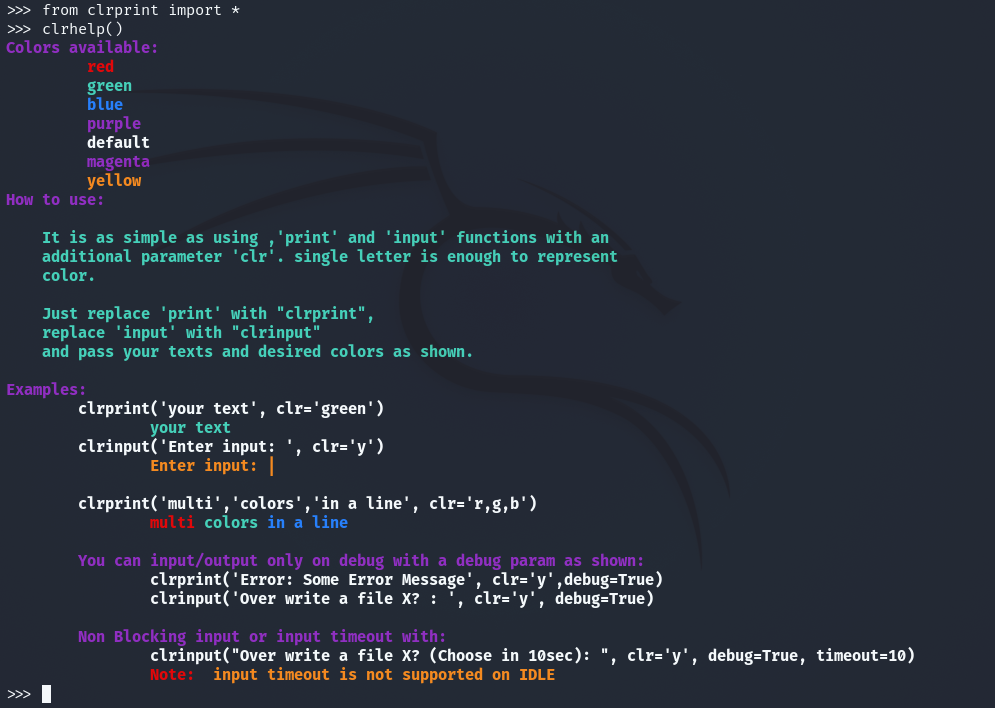
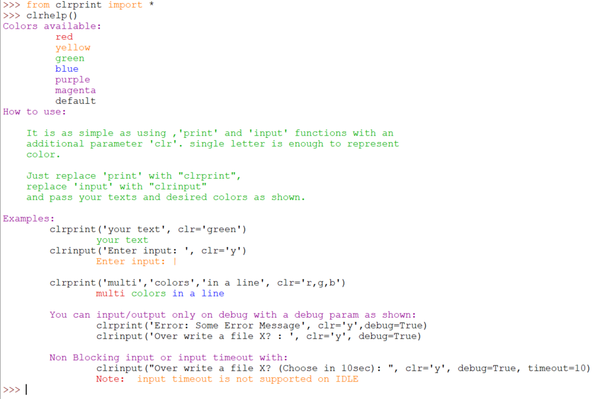
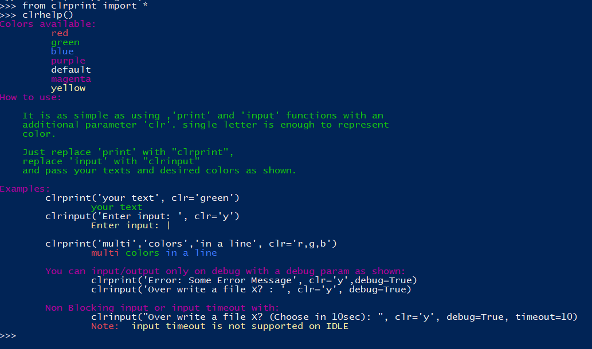

<h1 align="center">
  clrprint v2.0
<div align="center">

[](https://www.linkedin.com/in/abhijith-boppe/)  
[](https://www.python.org/) [](https://pypi.org/project/clrprint/) [](https://github.com/AbhijithAJ/clrprint/blob/master/LICENSE) [](https://www.paypal.me/abhijithboppes) 
</div>


</h1>
 
 - Colorful output 
 - Work's on IDLE, command prompt, windows powerShell, and terminal
 - Simply input() with clrinput() and print() with clrprint()
 - Basic colors only. Red, green, yellow, blue, purple, and black/white (default)
 - Flexible to print or take input only on demand (on DEBUG)
 - User input timeout feature (This is supported only on interactive shell)
---
## ABOUT

This **clrprint** is developed to print a colorful output on idle, windows power shell and terminal. It has red, blue, green, yellow, purple and black/white (default) colors. 

clrinput() includes a timeout feature that returns None if no user input is received within a certain amount of time.

*It prints with default color if given color is not available.*

### Installation
You can install clrprint by running the following command
```
pip install clrprint
```

**Usage**

It's as simple as using Python's print() and input() functions.

Argument **clr** to represent color, **debug** to print only when debug=True are added.

clrinput() takes **timeout** argument that returns None if no user input is not received within a certain amount of time.

*Note: **timeout** feature is not supported in IDLE. It is neglected by IDLE if it is passed*

You can use clrhelp() to print out and see how to use it.

Example Code:
```python
from clrprint import *

clrprint('text1','text2', clr='r')  # single letter is enough to represent color.
clrprint('text1_clr1','text2_clr2','text3_clr3','text4_clr4', clr='r,y,g') # prints 3 colors in same line
clrprint('ERROR:','error information','suggestions 1','suggestion2','suggestion3', clr='r,y,g') # print

#Supported on terminal, command prompt and powershell 
colord_text = clrit('text1', 'text2', clr='r,g') # returns ASCII coloured text
print(colord_text)
user_input = clrinput('Choose yes/no?', clr='r', timeout=10) or "DEFAULT"  # Take user input in 10 sec else Choose any Default value
print(user_input)

```

The input timeout functionality was inspired by <b><i>[WereCatf](https://github.com/WereCatf) </i> </b> from the project <b><i>[werecatf](https://github.com/werecatf/pytimedinput/) </i></b>

## Screenshots
Terminal:



IDLE:



Powershell:




### Example Code
```python
'''
Developed by Abhijith Boppe - linkedin.com/in/abhijith-boppe/
'''
from clrprint import *

userclr = clrinput('Enter color: ',clr='green').strip()  # prompt color text
clrprint('You enterd', userclr,clr=userclr) # print it in that color

# If color not available it print's with default color (white/black)

# Input timeout and clrit (Works on terminal, cmd and powershell. Not supported on IDLE).
continue_ = clrinput('Continue FUZZING? :',clr='p', timeout=15) or False # if no user input in 15, take False
if continue_:
  FUZZ()
colored_text = clrit('Text1', 'Text2', clr='r,g') # Returns ASCII colored text 
clrhelp()  # to list out usage and available colors.
```

<br>
<a href="https://www.buymeacoffee.com/abhijithboppe" target="_blank"></a>

---
## License & copyright
© Abhijith Boppe, Security analyst

<a href="https://linkedin.com/in/abhijith-boppe" target="_blank">LinkedIn</a>

© Dheeraj Kakkar, Software Developer

<a href="https://linkedin.com/in/dheerajkakkar" target="_blank">LinkedIn</a>


Licensed under the [MIT License](LICENSE)
